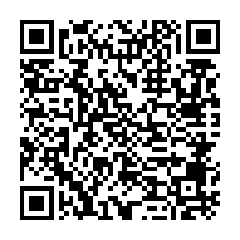

# Egui display-able struct with zero cost abstraction

## Status of developmenent

First version  0.1.0 works, use at your own risk.

## About

A derive trait for simple structs retainning data ready to be displayed with [egui](https://docs.rs/egui) without any allocation.


## Objective

Zero cost abstraction and simple derive macro to display structs. Developped first for [Gupax](https://github.com/gupax-io/gupax).
This crate is not intended to mutate the fields of the struct.

## Features

- [x] An easy trait to use

## Installation

```bash
cargo add --git https://github.com/Cyrix126/struct_zero_egui struct_zero_egui
```

## Usage


## Example

See the [derive example](/struct_zero_egui/examples/struct.rs) and [manual example](/struct_zero_egui/examples/manual_impl.rs).


## Bug Reporting

Open an [issue](https://github.com/Cyrix126/struct_zero_egui/issues) or contact me by email through [email](mailto:gupaxx@baermail.fr)

## Contributing

You can contribute by opening a PR.


## Security

## Documentation

```bash
cargo doc --open
```

## License


[See the licenses of various dependencies.](./Cargo.toml)

### Donations
If you'd like to thank me for the development of monero-crawler-rs and/or motivate me to improve it you're welcome to send any amount of XMR to the following address:


```ignore
4AGJScWSv45E28pmwck9YRP21KuwGx6fuMYV9kTxXFnWEij5FVEUyccBs7ExDy419DJXRPw3u57TH5BaGbsHTdnf6SvY5p5
```

Every donations will be converted to hours of work !

#### Donation transparency

A Kuno page exist so you can easily keep track of the amount funded in this project.

This project is used for Gupaxx, donations will be sent to the same address.
  
[Gupaxx Kuno](https://kuno.anne.media/fundraiser/dsrr/)  
In case you don't want to rely on the kuno website, the secret view key is:  

```ignore
6c6f841e1eda3fba95f2261baa4614e3ec614af2a97176bbae2c0be5281d1d0f
```
